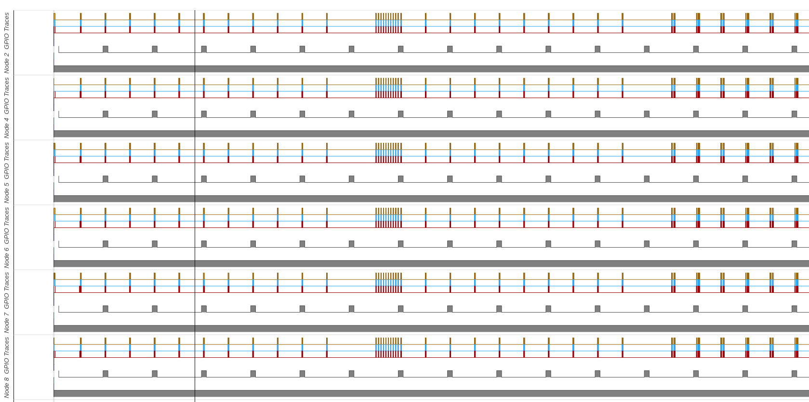

This example is a simple implementation of the TTnet stack, described in the following paper:
> **Time-Triggered Wireless Architecture**  
Romain Jacob, Licong Zhang, Marco Zimmerling, Samarjit Chakraborty, Lothar Thiele   
Accepted to ECRTS 2020  
[arXiv (submitted version)](https://arxiv.org/abs/2002.07491)

<!-- TOC depthFrom:2 depthTo:6 withLinks:1 updateOnSave:1 orderedList:0 -->

- [Short description](#short-description)
- [Run on FlockLab](#run-on-flocklab)

<!-- /TOC -->

## Short description
The software has been written for the DPP-cc430 platform, however it does run on the TelosB as well. When using the DPP, the **messages are not read from Bolt**, but artificially generated by the sender nodes.

The firmware executes hard-coded scheduling tables and switches between 3 different modes every 10 rounds:
+ Start on mode 1 (normal)  
_-> Two rounds per seconds_
* Switch to mode 2 (emergency)  
_-> One round every 50us_
* Switch back to mode 1 (normal)
* Switch to mode 0 (normal + update)  
_-> Increased load, requiring 4 rounds per node_

These scheduling tables are actual results from the [TTW Scheduler](https://github.com/romain-jacob/TTW-Scheduler) (produced the solving the `simple_example` configuration, see details therein).
Nodes and messages identifiers are listed in the `ttnet_nodes.h` and `ttnet_messages.h` respectively.

|Platform| Compilation command |
|:---|:---|
|DPP-cc430   | `make TARGET=dpp` - or - `make` |
|TelosB   | `make TARGET=sky` |

## Run on FlockLab

The [FlockLab testbed]() allows to runs and traces networking protocols remotely. After you have [setup FlockLab](https://github.com/ETHZ-TEC/Baloo/wiki/Run-on-Flocklab), you can easily run any Baloo program on the testbed. To run the TTnet firmware on FlockLab, simply execute the following command:
```bash
make FLOCKLAB=1 clean all flocklab_test
```
> The first time you use the tool, you will be prompted to enter you FlockLab login and password information. If you save these, you will not have to do this again.

You get the scheduling message in your terminal, including your `TESTID`.
After the test has run, you can download the test results and visualize the GPIO traces in your web browser with a single command:
```bash
make flocklab_viz TESTID=<your-test-id>
```
Should should obtain an output similar to the following:


The four different phases correspond to the different modes (see [Short description](#Short-description)). In the last mode (normal + update), the load increases compare to the third mode (normal), leading to a increase in number of rounds.

If you zoom in the plot (simply scroll with your mouse), you can observer the communication slots (in red) and the Glossy phases: transmissions (TX, in yellow) and receptions (RX, in blue).

The delay between the modes is due to the very basic mode change protocol currently implemented: the start of the new mode is delayed by one hyperperiod of the current mode. This is (very!) conservative but simple and guarantees rounds in the new and old mode do not overlap.


<!-- First attempt to implement the TTnet stack using Baloo.
The application is functional (tested on FlockLab), but the scheduling tables must currently be filled manually, which makes things highly impractical.
Needs to be integrated with the external scheduler. -->
